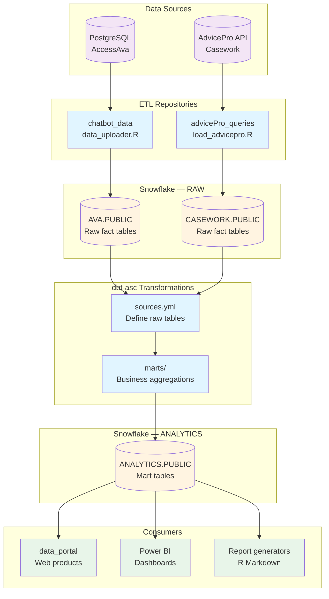

# dbt-asc

dbt (data build tool) transformation layer for Access Social Care's Snowflake data warehouse. Creates governed business logic transformations and aggregated mart tables for web products, Power BI, and reporting.

## Installation

### Prerequisites

- **dbt-core** >= 1.7.0
- **dbt-snowflake** adapter >= 1.7.0
- **Python** 3.8+ (for dbt)
- **Snowflake access**: Credentials via environment variables (same as existing ETL jobs)

### Install dbt

```bash
# On VM (Linux)
pip3 install dbt-core dbt-snowflake

# Verify installation
dbt --version
```

### Configure connection

1. Copy profiles template to standard dbt location:
   ```bash
   mkdir -p ~/.dbt
   cp setup/profiles.yml.template ~/.dbt/profiles.yml
   ```

2. Verify environment variables are set (should already exist for ETL jobs):
   ```bash
   echo $SNOWFLAKE_USER
   echo $SNOWFLAKE_KEY_FILE
   ```

3. Test connection:
   ```bash
   cd /srv/projects/dbt-asc  # On VM
   dbt debug
   ```

### Install dbt packages

```bash
dbt deps  # Installs dbt-utils and other dependencies
```

### Install docs service (optional but recommended)

Set up dbt documentation server as a systemd service for 24/7 availability:

```bash
# On VM as root/sudo
cd /srv/projects/dbt-asc
sudo bash setup/install_docs_service.sh
```

This installs a systemd service that auto-starts on boot and restarts on failure. See [Documentation Site](#documentation-site) section for usage details.

### Run Snowflake setup (one-time)

Execute `setup/snowflake_permissions.sql` as Snowflake ACCOUNTADMIN to:
- Create `ANALYTICS` database (separate from raw data)
- Create `ROLE_DBT_TRANSFORM` role
- Grant read permissions on AVA.PUBLIC and CASEWORK.PUBLIC
- Grant write permissions on ANALYTICS.PUBLIC
- Configure Power BI read access

## Overview

**Purpose**: Create a governed transformation layer on top of raw Snowflake tables loaded by ETL repos (chatbot_data, advicePro_queries, etc.). Transforms raw data into business-ready aggregate tables for web products and reporting.

**Current state**: Proof-of-concept with two chatbot mart tables. Will expand to casework, helplines, and cross-source analytical models.

**Workflow**:
1. Source ETL repos load raw data to Snowflake (AVA.PUBLIC, CASEWORK.PUBLIC)
2. dbt runs transformations daily via cron (after ETL completes)
3. dbt writes transformed tables to ANALYTICS.PUBLIC
4. Web products and Power BI query ANALYTICS.PUBLIC (not raw schemas)

**Governance model**: Business logic defined in SQL models with approval workflow via GitHub PRs. Each model documents owner and approval requirements in comments and schema.yml.

**Architecture principle**: Raw data databases (AVA, CASEWORK) owned by ETL repos. ANALYTICS database owned by dbt. Clean separation between extraction and transformation layers.

## Conceptual Flow



## How Files Work Together

### Project Structure

```
dbt-asc/
├── dbt_project.yml          # Main project config
├── packages.yml             # dbt package dependencies (dbt-utils)
├── models/
│   ├── sources.yml          # Define raw Snowflake tables
│   ├── staging/             # (Future) Light transformations of raw data
│   └── marts/               # Business aggregations for end users
│       ├── schema.yml       # Model documentation and tests
│       ├── mart_chatbot_conversations_by_tenant_monthly.sql
│       └── mart_chatbot_conversations_by_tenant_total.sql
├── seeds/                   # (Future) CSV reference data loaded as tables
├── macros/                  # (Future) Reusable SQL functions
├── tests/                   # (Future) Custom data quality tests
└── setup/
    ├── profiles.yml.template   # Connection config template
    └── snowflake_permissions.sql  # One-time Snowflake setup
```

### Execution Flow

1. **Source definition** (`models/sources.yml`):
   - Declares `AVA.ACCESSAVA.ACCESSAVA` as source table
   - Defines freshness checks (warn if >36 hours stale)
   - Provides documentation and schema for raw data

2. **Mart models** (`models/marts/chatbot/*.sql`):
   - Reference source using `{{ source('accessava', 'accessava') }}` macro
   - Contain business logic (GROUP BY, aggregations)
   - Build as tables in `ANALYTICS.PUBLIC` schema

3. **Tests** (`models/marts/chatbot/schema.yml`):
   - not_null checks on key columns
   - unique checks on primary keys
   - unique_combination_of_columns for composite keys
   - Run via `dbt test`

4. **Documentation** (`dbt docs generate`):
   - Generates searchable site showing lineage DAG
   - Column-level descriptions from schema.yml
   - Business owner and approval requirements

### Daily Workflow (Automated via Cron)

```bash
# 01:00-05:00 - Source ETL jobs run (chatbot_data, etc.)
# 05:30 - dbt transformation layer runs
cd /srv/projects/dbt-asc
dbt run --target prod     # Build all models
dbt test                  # Run data quality tests
# Output logged to /var/log/dbt_run.log
```

## Inputs

### Primary Data Sources (via dbt sources)

- **AVA.PUBLIC.ACCESSAVA** - Chatbot conversation fact table
  - Loaded by: [chatbot_data/data_uploader.R](../chatbot_data/data_uploader.R)
  - Refresh: Daily at 05:00 UTC
  - Rows: ~15,000 conversations/year
  - Key columns: transcript_id (PK), created_at, tenant_name, persona, categories, etc.

- **CASEWORK.PUBLIC.*** - Legal casework tables (future)
  - Loaded by: [advicePro_queries/load_advicepro_to_snowflake.R](../advicePro_queries/load_advicepro_to_snowflake.R)
  - Refresh: Monthly (manual)
  - Rows: ~2,500 cases/year
  - Note: CASEWORK is a separate database from AVA

### Environment Variables

Reuses existing Snowflake ETL credentials sourced from `/home/amit/.snowflake_env`:
- `SNOWFLAKE_USER` - Should be `ETL_USER`
- `SNOWFLAKE_KEY_FILE` - Path to RSA private key (`/home/amit/.ssh/snowflake/rsa_key.p8`)

No new credentials required - dbt uses same authentication as R ETL jobs.

### Developer Access

For developers querying ANALYTICS.PUBLIC tables (Python, Node.js, JDBC, etc.), see:
- **Setup**: [setup/create_tenant_reports_user.sql](setup/create_tenant_reports_user.sql) - Creates `TENANT_REPORTS_USER` and `ROLE_TENANT_REPORTS_READ`
- **Connection guide**: [../admin/snowflake_developer_connection_guide.md](../admin/snowflake_developer_connection_guide.md) - Environment setup and code examples

## Outputs

### Snowflake Tables (ANALYTICS.PUBLIC schema)

**Current** (Chatbot marts):
- `MART_CHATBOT_CONVERSATIONS_BY_TENANT_MONTHLY` - Monthly conversation counts per tenant
- `MART_CHATBOT_CONVERSATIONS_BY_TENANT_TOTAL` - All-time conversation totals per tenant

**Planned** (Casework marts):
- `MART_CASEWORK_BY_MEMBER` - Legal casework aggregations by member organization
- `MART_CASEWORK_REFERRALS_BY_LA` - Referral patterns by local authority

**Planned** (Unified marts - cross-database):
- `MART_UNIFIED_LOCAL_AUTHORITIES` - Canonical LA dimension across sources
- `MART_CITIZEN_JOURNEY` - Cross-source unified view (chatbot → casework linkage)

**Note**: All marts live in single `ANALYTICS.PUBLIC` schema. Organization by domain (chatbot/casework/unified) happens via folder structure and table naming conventions, not separate schemas.

### Documentation Site

Interactive lineage and data dictionary UI served as a systemd service for 24/7 availability.

**Initial setup (one-time)**:
```bash
# On VM as root/sudo
cd /srv/projects/dbt-asc
sudo bash setup/install_docs_service.sh
```

This installs `dbt-docs.service` which:
- Auto-generates docs on startup via `dbt docs generate`
- Serves docs on port 8082
- Restarts automatically on failure
- Starts on boot
- Logs to systemd journal

**Managing the service**:
```bash
sudo systemctl status dbt-docs    # Check status
sudo systemctl stop dbt-docs      # Stop service
sudo systemctl start dbt-docs     # Start service  
sudo systemctl restart dbt-docs   # Restart (e.g., after model changes)
sudo journalctl -u dbt-docs -f    # View logs (follow mode)
```

**Access**:
- **Direct** (if port open): http://data.accesscharity.org.uk:8082
- **SSH tunnel** (if blocked): `ssh -L 8082:localhost:8082 amit@data.accesscharity.org.uk` then visit http://localhost:8082
- **VS Code**: Forward port 8082 via Command Palette → "Forward a Port"

**Features**:
- Visual lineage DAG (source → staging → marts)
- Searchable data dictionary with column descriptions
- Compiled SQL for each model
- Test results and documentation

**Refresh docs after model changes**:
```bash
sudo systemctl restart dbt-docs  # Regenerates docs and restarts server
```

### Logs

- **Manual runs**: Output to console
- **Cron runs**: `/var/log/dbt_run.log`

## Flow and Other Dependencies

### Upstream Dependencies

**MUST run before dbt**:
- [chatbot_data/data_uploader.R](../chatbot_data/data_uploader.R) - Loads ACCESSAVA tables (cron: 05:00)
- (Future) [advicePro_queries/load_advicepro_to_snowflake.R](../advicePro_queries/load_advicepro_to_snowflake.R)

**Cron scheduling**:
```cron
# Existing: chatbot ETL
00 5 * * * /srv/projects/chatbot_data/data_uploader.sh >> /var/log/chatbot_snowflake_etl.log 2>&1

# New: dbt transformations (runs after chatbot ETL)
30 5 * * * cd /srv/projects/dbt-asc && dbt run --target prod >> /var/log/dbt_run.log 2>&1
```

### Downstream Consumers

Systems that query `ANALYTICS.PUBLIC` schema:
- **data_portal** - Web-based data access for external users
- **Power BI** - Internal dashboards via `ROLE_PBI_READ`
- **Report generators** - R Markdown reports can query mart tables instead of raw data

**Connection pattern**: Consumers point to `ANALYTICS.PUBLIC.*` (not AVA or CASEWORK). This creates clean separation - if raw schemas change, consumers are insulated as long as mart contracts remain stable.

### Cross-Repo Coordination

- **ascFuncs** - Shared R package for Snowflake connections (not used by dbt, but provides helper functions for R consumers of ANALYTICS tables)
- **admin** - Strategy docs, Snowflake credentials, cron registry
- **chatbot_data**, **advicePro_queries** - Own raw data loading to AVA/CASEWORK databases; dbt consumes their outputs
- **data_portal** - Consumes ANALYTICS.PUBLIC tables for web products

## Change Log

| Date | Version | Changes |
|------|---------|---------|  
| 2026-03-16 | 0.2.1 | **Infrastructure**: Added systemd service for dbt docs server (`setup/dbt-docs.service`, `setup/install_docs_service.sh`) for 24/7 availability |
| 2026-03-11 | 0.2.0 | **Architecture change**: ANALYTICS.PUBLIC (separate database) instead of AVA.ANALYTICS |
| 2026-03-11 | 0.1.0 | Initial setup: dbt project structure, two chatbot mart models, Snowflake permissions, README |

## Caveats

### Known Issues

1. **Column names not verified**: SQL models use placeholder column name `organisation_name` for tenant field. Need to verify actual column name in Snowflake before first dbt run.
   - **Fix**: Run `SELECT * FROM AVA.ACCESSAVA.ACCESSAVA LIMIT 1` and update SQL models

2. **AVA database may not exist**: Initial Snowflake setup not confirmed - database might need creation.
   - **Fix**: Run `setup/snowflake_permissions.sql` as ACCOUNTADMIN

3. **No dev environment yet**: Only prod target defined. Local development currently writes to prod schemas.
   - **Risk**: Accidental prod modification during testing
   - **Fix**: Switch to `--target dev` which writes to ANALYTICS.DEV schema

4. **Full refresh only**: All models use `materialized='table'` which rebuilds entire table each run.
   - **Performance**: Fine at current scale (~15K rows), but won't scale to millions
   - **Future**: Switch to `materialized='incremental'` for large fact tables

5. **No alerting**: Cron job failures only visible by manually checking logs.
   - **Fix**: Add Slack/email notifications on failure, or adopt dbt Cloud for built-in alerting

6. **Business owner placeholders**: `schema.yml` includes `[PM name - update this]` placeholder for approval workflow owner.
   - **Fix**: Update with actual PM name once governance process is confirmed

7. **dbt docs service**: Documentation server runs as systemd service on port 8082 (not default 8080/8081) to avoid common conflicts. Service file at `setup/dbt-docs.service` manages automatic startup, restart on failure, and logging.
   - **Note**: Documented in admin for VM infrastructure reference

### Data Quality Limitations

These are inherited from source data, not dbt-specific:
- Demographics <5% complete in ACCESSAVA (can't filter/aggregate by age/ethnicity reliably)
- Local authority data ~20% complete in chatbot, 90% in casework
- No cross-source identifiers for citizen journey tracking (planned future work)

### Future Enhancements

Track these separately in GitHub issues:
- [ ] Verify and fix column names in SQL models
- [ ] Add staging models for standardization (e.g., LA name cleaning)
- [ ] Create intermediate models for reusable business logic
- [ ] Add casework mart tables once advicePro_queries Snowflake ETL is production-ready
- [ ] Build cross-source unified models (citizen journey, canonical dimensions)
- [ ] Implement incremental models for performance
- [ ] Set up dbt Cloud for UI/monitoring (vs. cron)
- [ ] Add macro for common aggregation patterns
- [ ] Create seed tables for reference data (member name mapping, ONS lookups)

## Tags

`dbt` `snowflake` `etl` `transformation` `data-warehouse` `analytics` `governance` `chatbot` `casework` `business-intelligence`
