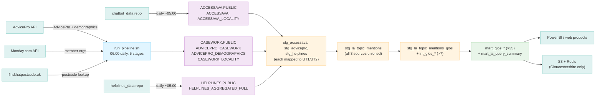

# dbt-asc

> **Domain knowledge, invariants, schema model:** [CHARTER.md](CHARTER.md)

dbt transformation layer for Access Social Care's Snowflake data warehouse. Combines raw data from three sources (AccessAva chatbot, AdvicePro casework, Access Helplines) onto a shared Universal Theme (UT1/UT2) taxonomy, producing governed staging, intermediate, and mart tables for web products, Power BI, S3, and Redis.

**Repo also contains the Snowflake loaders** (`loaders/`) - R scripts that pull from upstream APIs and write raw tables to Snowflake before dbt runs, plus export scripts that push finished mart tables out to S3/Redis after dbt runs.

> **New to dbt?** Start with [docs/pipeline-explainer.md](docs/pipeline-explainer.md) - a narrative walkthrough covering what each component is, how data moves from API to Power BI, and how to check the pipeline is healthy.

---

## Architecture



Three raw sources feed into dbt:

| Database | Schema | Loaded by | Schedule |
|---|---|---|---|
| `ACCESSAVA` | `PUBLIC` | `chatbot_data` repo (`data_uploader.R`) | Daily ~05:00 |
| `CASEWORK` | `PUBLIC` | `loaders/` in this repo (Stage 1 of `run_pipeline.sh`) | Daily 06:00 |
| `HELPLINES` | `PUBLIC` | `helplines_data` repo | Daily ~05:00 |

dbt writes each layer into its own schema (see [docs/pipeline-explainer.md](docs/pipeline-explainer.md#where-things-land-schemas) for the full table) - there is no single shared output schema. LA product marts land in `ANALYTICS.PUBLIC_LA_PRODUCT`; chatbot marts land in `ANALYTICS.PUBLIC`.

---

## Daily Pipeline (Cron)

`run_pipeline.sh` is the single entry point - five sequential stages:

```
06:00  Stage 1: R loaders (AdvicePro, Monday.com, postcode lookup) → Snowflake raw tables
       Stage 2: dbt build → staging/intermediate/mart schemas
       Stage 3: S3 + Redis export (Gloucestershire mart tables)
       Stage 4: dbt docs generate
       Stage 5: Observability (source freshness + staleness check) — non-fatal
```

Stages 1-3 abort the pipeline on failure. Stage 4/5 failures are logged but don't fail the run.

**Crontab entry** (on the VM - edit with `crontab -e`):
```
0 6 * * * /srv/projects/dbt-asc/run_pipeline.sh >> /srv/projects/cc/run_pipeline.timeRun.txt 2>&1
```

To re-run just one stage manually on the VM (e.g. after fixing a model, without re-pulling API data):
```bash
cd /srv/projects/dbt-asc
~/.local/bin/dbt build              # Stage 2 only
Rscript loaders/export_la_queries_to_s3.R   # Stage 3 only
```

---

## Repository Structure

```
dbt-asc/
├── dbt_project.yml           # Main project config - schema-per-folder mapping lives here
├── packages.yml              # dbt package dependencies (dbt-utils)
│
├── run_pipeline.sh           # CRONTAB 06:00 - the only entry point: loaders → dbt → S3/Redis → docs → observability
│
├── loaders/                  # R scripts: extract from APIs, load to Snowflake RAW, and export marts out
│   ├── load_advicepro_demographics_to_snowflake.R  # AdvicePro FD7DXGL4 → CASEWORK.ADVICEPRO_DEMOGRAPHICS
│   ├── load_casework_locality_to_snowflake.R       # AdvicePro PWVDK69X → CASEWORK.CASEWORK_LOCALITY (county, ward)
│   ├── load_member_orgs_to_snowflake.R             # Monday.com → REFERENCE.MEMBER_ORGANISATIONS
│   ├── export_la_queries_to_s3.R                   # Stage 3: all la_product mart tables → S3 + Redis
│   ├── export_glou_signals_to_s3.R                 # Signal processing export (separate from LA product) → S3/Redis
│   ├── export_hypothesis_findings_to_s3.R          # Hypothesis Tracker findings export → S3/Redis
│   ├── snowflake_staleness_check.R                 # Stage 5: ETL-level freshness check
│   └── report_schemas.yml   # Schema registry: raw API column names → normalized names → target table
│
├── models/
│   ├── sources.yml           # dbt source declarations for all raw Snowflake tables
│   ├── staging/
│   │   ├── la_product/
│   │   │   ├── stg_accessava.sql            # AccessAva mapped to UT1/UT2
│   │   │   ├── stg_advicepro.sql            # AdvicePro mapped to UT1/UT2
│   │   │   ├── stg_helplines.sql            # Helplines, already UT1-native
│   │   │   ├── stg_la_topic_mentions.sql    # UNION ALL of all three - topic-mention grain
│   │   │   ├── stg_la_topic_mentions_glos.sql  # Gloucestershire filter
│   │   │   ├── schema.yml
│   │   │   └── README.md    # Detailed architecture notes for this layer
│   │   └── acs_helplines/
│   │       └── helplines_advicepro_accessava.sql  # Monthly UT1/UT2 cross-source aggregate
│   ├── intermediate/
│   │   └── la_product/
│   │       └── int_glos_*.sql   # 7 models, Gloucestershire aggregations, all 5 time windows pre-computed
│   └── marts/
│       ├── chatbot/
│       │   ├── mart_chatbot_conversations_by_tenant_monthly.sql
│       │   └── mart_chatbot_conversations_by_tenant_total.sql
│       └── la_product/
│           ├── mart_glos_*_{1m,3m,6m,9m,12m}.sql   # 35 models: 7 view families × 5 time windows
│           └── mart_la_query_summary.sql            # All LAs, all-time, no suppression
│
├── macros/
│   └── la_product/           # Reusable SQL logic called once per time window by int_glos_* models
│       ├── la_activity_summary.sql
│       ├── la_demographics.sql
│       ├── la_legal_letters.sql
│       ├── la_locality_overview.sql
│       ├── la_queries_over_time.sql
│       ├── la_query_segments.sql
│       ├── la_query_source.sql
│       └── la_suppress.sql
│
├── logs/                     # Runtime logs (git-ignored)
│   └── dbt_run.log           # Full dbt output, overwritten each run
│
└── setup/
    ├── profiles.yml.template
    ├── snowflake_permissions.sql
    ├── create_tenant_reports_user.sql
    └── SETUP_GUIDE.md
```

---

## Installation

### Prerequisites

- **dbt-core** >= 1.7.0
- **dbt-snowflake** adapter >= 1.7.0
- **Python** 3.8+ (for dbt)
- **R** with `ascFuncs`, `logger`, `DBI`, `httr` packages (for loaders)
- **Snowflake access**: credentials in `~/.asc_secrets` on the VM

### Install dbt

```bash
pip3 install dbt-core dbt-snowflake
dbt --version
```

### Configure connection

```bash
mkdir -p ~/.dbt
cp setup/profiles.yml.template ~/.dbt/profiles.yml
# Edit ~/.dbt/profiles.yml with Snowflake user/key path
dbt debug   # Verify connection
```

Credentials are sourced from `~/.asc_secrets` (same file as R ETL jobs). Required variables: `SNOWFLAKE_USER`, `SNOWFLAKE_KEY_FILE`.

### Install dbt packages

```bash
dbt deps
```

### One-time Snowflake setup

Run `setup/snowflake_permissions.sql` as ACCOUNTADMIN to create the ANALYTICS database, roles, and grants.

Also grant schema creation to the ETL role:
```sql
GRANT CREATE SCHEMA ON DATABASE ANALYTICS TO ROLE ROLE_ETL_WRITE;
```

---

## Loaders

R scripts in `loaders/` extract from upstream APIs and write raw tables to Snowflake before dbt runs, and export finished mart tables to S3/Redis after dbt runs. `run_pipeline.sh` is the only orchestrator - there is no separate loaders-only or dbt-only entry point script in this repo.

**Stage 1 - source and derived loads** (in dependency order):
- `load_member_orgs_to_snowflake.R` - Monday.com board → `REFERENCE.MEMBER_ORGANISATIONS`
- `load_advicepro_demographics_to_snowflake.R` - AdvicePro API → `CASEWORK.ADVICEPRO_DEMOGRAPHICS` (full replace)
- `load_casework_locality_to_snowflake.R` - reads case postcodes written by the demographics loader, looks each one up via [findthatpostcode.uk](https://findthatpostcode.uk), stores county/ward/etc. as `CASEWORK.CASEWORK_LOCALITY`. Must run after the demographics loader.

**Why is the postcode lookup needed?** AdvicePro stores cases with the client's postcode, not their local authority or county. There is no geography field in the raw AdvicePro data. The locality loader bridges this gap. AccessAva (the chatbot) is different - it already knows which LA a user belongs to (set at login) and resolves its own locality via `chatbot_data`'s own loader, so this repo's loaders don't touch AccessAva at all.

**Stage 3 - export scripts** (run after `dbt build`):
- `export_la_queries_to_s3.R` - discovers every table in the `la_product` mart schema at runtime, pushes each to S3 (JSON) and Redis. This is the LA data product's only current output destination for Gloucestershire.
- `export_glou_signals_to_s3.R`, `export_hypothesis_findings_to_s3.R` - separate exports (signal processing / hypothesis tracker), not part of the LA data product lineage documented here.

### Adding a new loader

1. Create `loaders/load_{name}_to_snowflake.R`
2. Add a `run_loader` call to `run_pipeline.sh` Stage 1 (source loads first, derived loads after)
3. Document the API report columns in `loaders/report_schemas.yml`
4. Add the target table to `models/sources.yml`

### report_schemas.yml

Schema registry for all AdvicePro API reports. Documents the mapping between raw UI column names (with spaces) and normalized column names (tolower + gsub), plus which script consumes each report and where it writes. This is the canonical reference when debugging column name errors.

---

## Models

See [models/staging/la_product/README.md](models/staging/la_product/README.md) for the full staging/intermediate architecture, lineage diagram, and per-source null availability. Summary:

### Staging - `models/staging/la_product/` and `models/staging/acs_helplines/`

| Model | Description |
|---|---|
| `stg_accessava.sql` | AccessAva conversations, mapped to UT1/UT2 via `topic_entry_point_map`. Joins `accessava_locality` for county. |
| `stg_advicepro.sql` | AdvicePro cases, mapped to UT1/UT2 via `case_topic_bridge` → `s_c_csi_map` → `universal_themes_map`. Joins `casework_locality` for county, `advicepro_demographics` for age. |
| `stg_helplines.sql` | Helplines calls, already UT1-native (pre-aggregated by the `helplines_data` ETL). |
| `stg_la_topic_mentions.sql` | `UNION ALL` of all three sources. Grain: one row per topic mention - not one row per conversation/case/query. |
| `stg_la_topic_mentions_glos.sql` | Gloucestershire-only filter of the above - base for all `int_glos_*` and `mart_glos_*` models. |
| `helplines_advicepro_accessava.sql` | Monthly UT1/UT2 cross-source aggregate, reads from `stg_la_topic_mentions`. No known live consumers. |

### Intermediate - `models/intermediate/la_product/`

7 `int_glos_*` models, each pre-computing all 5 time windows (1m/3m/6m/9m/12m) of raw, unsuppressed counts for one analytical angle (activity summary, demographics, legal letters, locality overview, queries over time, query segments, query source).

### Marts - `models/marts/`

| Model | Description |
|---|---|
| `mart_chatbot_*` (2 models) | Chatbot operational metrics - conversation counts split by tenant (LA), monthly and all-time. These are internal chatbot-team tables, separate from the LA product. They count *conversations*, not queries or cases. |
| `mart_glos_*` (35 models) | LA product views for the Gloucestershire PoC - 7 analytical angles × 5 time windows each, sliced from the matching `int_glos_*` table with `la_suppress()` applied. |
| `mart_la_query_summary.sql` | All LAs, all-time, no time windows or suppression - LA × source system × UT1 segment. Ad-hoc cross-LA analysis, not part of the Gloucestershire product. |

**How sources are distinguished in the LA product:** `mart_glos_la_query_source_*` shows query counts split by `SOURCE_SYSTEM` ('AccessAva', 'AdvicePro', or 'Helplines'). This is the source breakdown for the LA product - not by chatbot tenant. All three sources are normalised into the same row shape (UT1/UT2-mapped, topic-mention grain) at the `stg_la_topic_mentions` layer before any intermediate or mart model sees them.

### Macros - `macros/la_product/`

Reusable SQL logic called by the `int_glos_*` intermediate models (not directly by marts). Each macro takes `months_back` and a `source_model` (defaulting to `stg_la_topic_mentions_glos`) and produces a filtered, aggregated SELECT - `suppress=false` for the raw `int_glos_*` layer, `suppress=true` when called directly for BI use. The `int_glos_*` model files are UNION ALL chains of five macro calls (1, 3, 6, 9, 12 months); the `mart_glos_*` files then just slice by `TIME_WINDOW_MONTHS` and re-apply suppression.

`la_suppress(expr)` is applied at the marts layer: any count below 5 becomes the string `'1-5'`. Output columns that use it are `VARCHAR`, not numeric - Power BI must treat them as strings.

---

## Outputs

dbt writes into schema-per-folder targets (see [docs/pipeline-explainer.md](docs/pipeline-explainer.md#where-things-land-schemas)) - `ANALYTICS.PUBLIC_LA_PRODUCT` for the Gloucestershire LA product marts (RBAC-restricted, also exported to S3/Redis by Stage 3), `ANALYTICS.PUBLIC` for chatbot marts. Web products and Power BI connect to these mart schemas only - never directly to `ACCESSAVA`, `CASEWORK`, or `HELPLINES`.

### dbt Docs

Live docs: **`https://control.accesscharity.org.uk/p/ff1934c2/#!/overview`**

Docs are regenerated automatically as Stage 4 of `run_pipeline.sh` after every successful `dbt build`. Output lands in `target/` and is served via nginx on the VM.

---

## Monitoring (Command Centre)

The cc dashboard at `data.accesscharity.org.uk/cc.html` monitors this repo:

- **Errors**: scans all `.log` and `.timeRun.txt` files under `/srv/projects/` for `Error`/`error` and `command not found` lines (dbt's internal `logs/dbt.log` is excluded - too verbose)
- **Runtime**: reads `run_pipeline.timeRun.txt` written by the cron entry

> **Package updates**: if `packages.yml` changes, run `dbt deps` manually on the VM before the next cron run - it is not part of the daily pipeline.

If dbt fails, cc will open a GitHub issue in this repo automatically.

---

## Developer Access

For querying LA product mart tables from Python, R, or BI tools, see:
- `setup/create_tenant_reports_user.sql` - creates `TENANT_REPORTS_USER` + `ROLE_TENANT_REPORTS_READ`
- `../admin/snowflake_developer_connection_guide.md` - connection setup and examples
