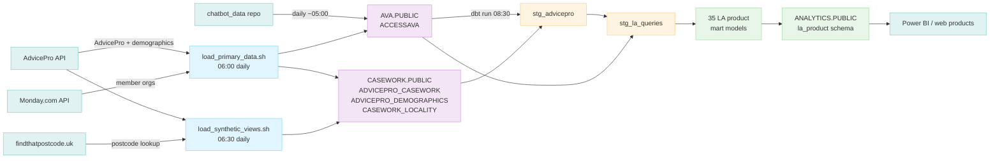
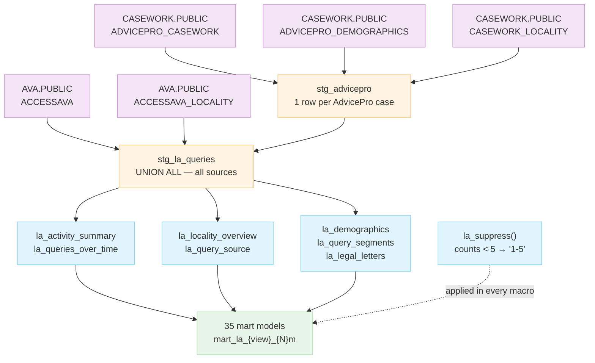

# dbt-asc

dbt transformation layer for Access Social Care's Snowflake data warehouse. Combines raw data from three sources (chatbot, AdvicePro casework, helplines) into governed mart and staging tables for web products, Power BI, and reporting.

**Repo also contains the Snowflake loaders** (`loaders/`) — R scripts that pull from upstream APIs and write raw tables to Snowflake before dbt runs.

---

## Architecture



Three raw databases feed into dbt:

| Database | Schema | Loaded by | Schedule |
|---|---|---|---|
| `AVA` | `PUBLIC` | `chatbot_data` repo (`data_uploader.R`) | Daily ~05:00 |
| `CASEWORK` | `PUBLIC` | `loaders/load_primary_data.sh` + `load_synthetic_views.sh` (this repo) | Daily 06:00-06:30 |
| `HELPLINES` | `PUBLIC` | `helplines_data` repo | Daily ~05:00 |

dbt transforms all three into `ANALYTICS.PUBLIC` — the single schema consumed by web products and Power BI.

---

## Daily Pipeline (Cron)

```
06:00  load_primary_data.sh   — AdvicePro API + Monday.com → CASEWORK/AVA/REFERENCE tables
06:30  load_synthetic_views.sh — case postcodes → findthatpostcode.uk → CASEWORK_LOCALITY
```

**Crontab entries** (on the VM — edit with `crontab -e`):
```
0  6 * * * /srv/projects/dbt-asc/loaders/load_primary_data.sh >> /srv/projects/cc/load_primary_data.timeRun.txt 2>&1
30 6 * * * /srv/projects/dbt-asc/loaders/load_synthetic_views.sh >> /srv/projects/cc/load_synthetic_views.timeRun.txt 2>&1
```

---

## Repository Structure

```
dbt-asc/
├── dbt_project.yml           # Main project config (anonymous stats disabled)
├── packages.yml              # dbt package dependencies (dbt-utils)
│
├── dbt_pipeline.sh           # dbt runner (deps → run → test → docs generate)
│                             #   writes to logs/dbt_run.log (overwrites each run)
│
├── loaders/                  # R scripts: extract from APIs, load to Snowflake RAW
│   ├── load_primary_data.sh                      # CRONTAB 06:00 — source system loads
│   ├── load_synthetic_views.sh                   # CRONTAB 06:30 — derived/lookup loads
│   ├── load_advicepro_demographics_to_snowflake.R  # AdvicePro FD7DXGL4 → CASEWORK.ADVICEPRO_DEMOGRAPHICS
│   ├── load_casework_locality_to_snowflake.R       # AdvicePro PWVDK69X → CASEWORK.CASEWORK_LOCALITY
│   ├── load_member_orgs_to_snowflake.R             # Monday.com → REFERENCE.MEMBER_ORGANISATIONS
│   └── report_schemas.yml   # Schema registry: raw API column names → normalized names → target table
│
├── models/
│   ├── sources.yml           # dbt source declarations for all raw Snowflake tables
│   ├── staging/
│   │   └── la_product/
│   │       └── stg_la_queries.sql    # One row per interaction across all three sources
│   └── marts/
│       └── chatbot/
│           ├── mart_chatbot_conversations_by_tenant_monthly.sql
│           └── mart_chatbot_conversations_by_tenant_total.sql
│
├── macros/
│   └── la_product/           # Reusable SQL logic for LA product models
│       ├── la_activity_summary.sql
│       ├── la_demographics.sql
│       ├── la_legal_letters.sql
│       ├── la_locality_overview.sql
│       ├── la_queries_over_time.sql
│       ├── la_query_segments.sql
│       ├── la_query_source.sql
│       └── la_suppress.sql
│
├── logs/                     # Runtime logs (git-ignored)
│   └── dbt_run.log           # Full dbt output, overwritten each run
│
└── setup/
    ├── profiles.yml.template
    └── snowflake_permissions.sql
```

---

## Installation

### Prerequisites

- **dbt-core** >= 1.7.0
- **dbt-snowflake** adapter >= 1.7.0
- **Python** 3.8+ (for dbt)
- **R** with `ascFuncs`, `logger`, `DBI`, `httr` packages (for loaders)
- **Snowflake access**: credentials in `~/.asc_secrets` on the VM

### Install dbt

```bash
pip3 install dbt-core dbt-snowflake
dbt --version
```

### Configure connection

```bash
mkdir -p ~/.dbt
cp setup/profiles.yml.template ~/.dbt/profiles.yml
# Edit ~/.dbt/profiles.yml with Snowflake user/key path
dbt debug   # Verify connection
```

Credentials are sourced from `~/.asc_secrets` (same file as R ETL jobs). Required variables: `SNOWFLAKE_USER`, `SNOWFLAKE_KEY_FILE`.

### Install dbt packages

```bash
dbt deps
```

### One-time Snowflake setup

Run `setup/snowflake_permissions.sql` as ACCOUNTADMIN to create the ANALYTICS database, roles, and grants.

Also grant schema creation to the ETL role:
```sql
GRANT CREATE SCHEMA ON DATABASE ANALYTICS TO ROLE ROLE_ETL_WRITE;
```

---

## Loaders

R scripts in `loaders/` extract from upstream APIs and write raw tables to Snowflake before dbt runs. All loaders are driven by `run_all_loaders.sh`.

### Adding a new loader

1. Create `loaders/load_{name}_to_snowflake.R`
2. Add a `run_loader` call in `load_primary_data.sh` (source system) or `load_synthetic_views.sh` (derived/lookup)
3. Document the API report columns in `loaders/report_schemas.yml`
4. Add the target table to `models/sources.yml`

### report_schemas.yml

Schema registry for all AdvicePro API reports. Documents the mapping between raw UI column names (with spaces) and normalized column names (tolower + gsub), plus which script consumes each report and where it writes. This is the canonical reference when debugging column name errors.

---

## Models

### Staging — `models/staging/la_product/`

| Model | Description |
|---|---|
| `stg_advicepro.sql` | Stage 1 — joins `ADVICEPRO_CASEWORK` + `ADVICEPRO_DEMOGRAPHICS` + `CASEWORK_LOCALITY` into one row per case |
| `stg_la_queries.sql` | Stage 2 — UNION ALL of `stg_advicepro` and AccessAva. Single grain for all 35 mart models. Columns: `LA_NAME`, `QUERY_DATE`, `SOURCE_SYSTEM`, `QUERY_COUNT`, `SEGMENT`, `AGE_BAND`, `HAS_LETTER`, `LOCALITY_NAME` |

### Marts — `models/marts/`

| Model | Description |
|---|---|
| `mart_chatbot_*` (2 models) | Chatbot conversation counts by tenant (monthly + all-time) |
| `mart_la_{view}_{N}m` (35 models) | LA product views across 7 analytical angles × 5 time windows (1m, 3m, 6m, 9m, 12m) |

### Macros — `macros/la_product/`

Reusable SQL logic called by LA product mart models. Each macro takes `months_back` as a parameter and returns a filtered, aggregated, SDC-suppressed view.



---

## Outputs

All models write to `ANALYTICS.PUBLIC` in Snowflake. Web products and Power BI connect to this schema only — never directly to AVA, CASEWORK, or HELPLINES.

### dbt Docs

`dbt docs generate` runs daily as part of `dbt_pipeline.sh`. Output lands in `target/`. To serve:

```nginx
# nginx config (add to existing server block on VM)
location /dbt-docs/ {
    alias /srv/projects/dbt-asc/target/;
    index index.html;
}
```

---

## Monitoring (Command Centre)

The cc dashboard at `data.accesscharity.org.uk/cc.html` monitors this repo:

- **Errors**: scans `logs/dbt_run.log` for ERROR lines (dbt's internal `logs/dbt.log` is excluded — too verbose)
- **Runtime**: reads `dbt_run.timeRun.txt` written by `dbt_pipeline.sh`

If dbt fails, cc will open a GitHub issue in this repo automatically.

---

## Developer Access

For querying `ANALYTICS.PUBLIC` from Python, R, or BI tools, see:
- `setup/create_tenant_reports_user.sql` — creates `TENANT_REPORTS_USER` + `ROLE_TENANT_REPORTS_READ`
- `../admin/snowflake_developer_connection_guide.md` — connection setup and examples
