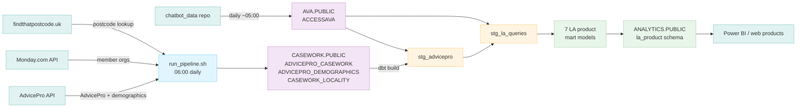

# dbt-asc

dbt transformation layer for Access Social Care's Snowflake data warehouse. Combines raw data from three sources (chatbot, AdvicePro casework, helplines) into governed mart and staging tables for web products, Power BI, and reporting.

**Repo also contains the Snowflake loaders** (`loaders/`) — R scripts that pull from upstream APIs and write raw tables to Snowflake before dbt runs.

> **New to dbt?** Start with [docs/pipeline-explainer.md](docs/pipeline-explainer.md) — a narrative walkthrough covering what each component is, how data moves from API to Power BI, and how to check the pipeline is healthy.

---

## Architecture



Three raw databases feed into dbt:

| Database | Schema | Loaded by | Schedule |
|---|---|---|---|
| `AVA` | `PUBLIC` | `chatbot_data` repo (`data_uploader.R`) | Daily ~05:00 |
| `CASEWORK` | `PUBLIC` | `run_pipeline.sh` Stage 1 (this repo) | Daily 06:00 |
| `HELPLINES` | `PUBLIC` | `helplines_data` repo | Daily ~05:00 |

dbt transforms all three into `ANALYTICS.PUBLIC` — the single schema consumed by web products and Power BI.

---

## Daily Pipeline (Cron)

```
06:00  run_pipeline.sh  — Stage 1: source loads (AdvicePro, Monday.com) → derived loads (postcode lookup)
                          Stage 2: dbt build → transforms everything → ANALYTICS schema
                          dbt only runs if all loaders succeed
```

**Crontab entry** (on the VM — edit with `crontab -e`):
```
0 6 * * * /srv/projects/dbt-asc/run_pipeline.sh >> /srv/projects/cc/run_pipeline.timeRun.txt 2>&1
```

---

## Repository Structure

```
dbt-asc/
├── dbt_project.yml           # Main project config (anonymous stats disabled)
├── packages.yml              # dbt package dependencies (dbt-utils)
│
├── run_pipeline.sh           # CRONTAB 06:00 — full pipeline: loaders then dbt (single entry)
│
├── loaders/                  # R scripts: extract from APIs, load to Snowflake RAW
│   ├── load_advicepro_demographics_to_snowflake.R  # AdvicePro FD7DXGL4 → CASEWORK.ADVICEPRO_DEMOGRAPHICS
│   ├── load_casework_locality_to_snowflake.R       # AdvicePro PWVDK69X → CASEWORK.CASEWORK_LOCALITY
│   ├── load_member_orgs_to_snowflake.R             # Monday.com → REFERENCE.MEMBER_ORGANISATIONS
│   └── report_schemas.yml   # Schema registry: raw API column names → normalized names → target table
│
├── models/
│   ├── sources.yml           # dbt source declarations for all raw Snowflake tables
│   ├── staging/
│   │   └── la_product/
│   │       └── stg_la_queries.sql    # One row per interaction across all three sources
│   └── marts/
│       └── chatbot/
│           ├── mart_chatbot_conversations_by_tenant_monthly.sql
│           └── mart_chatbot_conversations_by_tenant_total.sql
│
├── macros/
│   └── la_product/           # Reusable SQL logic for LA product models
│       ├── la_activity_summary.sql
│       ├── la_demographics.sql
│       ├── la_legal_letters.sql
│       ├── la_locality_overview.sql
│       ├── la_queries_over_time.sql
│       ├── la_query_segments.sql
│       ├── la_query_source.sql
│       └── la_suppress.sql
│
├── logs/                     # Runtime logs (git-ignored)
│
└── setup/
    ├── profiles.yml.template
    └── snowflake_permissions.sql
```

---

## Installation

### Prerequisites

- **dbt-core** >= 1.7.0
- **dbt-snowflake** adapter >= 1.7.0
- **Python** 3.8+ (for dbt)
- **R** with `ascFuncs`, `logger`, `DBI`, `httr` packages (for loaders)
- **Snowflake access**: credentials in `~/.asc_secrets` on the VM

### Install dbt

```bash
pip3 install dbt-core dbt-snowflake
dbt --version
```

### Configure connection

```bash
mkdir -p ~/.dbt
cp setup/profiles.yml.template ~/.dbt/profiles.yml
# Edit ~/.dbt/profiles.yml with Snowflake user/key path
dbt debug   # Verify connection
```

Credentials are sourced from `~/.asc_secrets` (same file as R ETL jobs). Required variables: `SNOWFLAKE_USER`, `SNOWFLAKE_KEY_FILE`.

### Install dbt packages

```bash
dbt deps
```

### One-time Snowflake setup

Run `setup/snowflake_permissions.sql` as ACCOUNTADMIN to create the ANALYTICS database, roles, and grants.

Also grant schema creation to the ETL role:
```sql
GRANT CREATE SCHEMA ON DATABASE ANALYTICS TO ROLE ROLE_ETL_WRITE;
```

---

## Loaders

R scripts in `loaders/` extract from upstream APIs and write raw tables to Snowflake before dbt runs. All loaders are driven by Stage 1 of `run_pipeline.sh`, which runs them in two phases:

**Phase 1 — source system loads** (no dependencies):
- `load_member_orgs_to_snowflake.R` — Monday.com board → `REFERENCE.MEMBER_ORGANISATIONS`
- `load_advicepro_demographics_to_snowflake.R` — AdvicePro API → `CASEWORK.ADVICEPRO_DEMOGRAPHICS` (full replace)

**Phase 2 — derived/lookup loads** (must run after phase 1):
- `load_casework_locality_to_snowflake.R` — reads case postcodes written by phase 1, looks each one up via [findthatpostcode.uk](https://findthatpostcode.uk), stores the resulting LA name as `CASEWORK.CASEWORK_LOCALITY`

**Why is the postcode lookup needed?** AdvicePro stores cases with the client's postcode, not their local authority. There is no LA field in the raw AdvicePro data. The locality loader bridges this gap. AccessAva (the chatbot) is different — it already knows which LA a user belongs to (set at login), so no lookup is needed for that source.

### Adding a new loader

1. Create `loaders/load_{name}_to_snowflake.R`
2. Add a `run_loader` call in `run_pipeline.sh` (Stage 1)
3. Document the API report columns in `loaders/report_schemas.yml`
4. Add the target table to `models/sources.yml`

### report_schemas.yml

Schema registry for all AdvicePro API reports. Documents the mapping between raw UI column names (with spaces) and normalized column names (tolower + gsub), plus which script consumes each report and where it writes. This is the canonical reference when debugging column name errors.

---

## Models

### Staging — `models/staging/la_product/`

| Model | Description |
|---|---|
| `stg_advicepro.sql` | Stage 1 — joins `ADVICEPRO_CASEWORK` + `ADVICEPRO_DEMOGRAPHICS` + `CASEWORK_LOCALITY` into one row per case. `CASEWORK_LOCALITY` is the resolved LA name (postcode lookup output from the loader). |
| `stg_la_queries.sql` | Stage 2 — UNION ALL of `stg_advicepro` and AccessAva. Single grain for all 7 mart models. Columns: `LA_NAME`, `QUERY_DATE`, `SOURCE_SYSTEM`, `QUERY_COUNT`, `SEGMENT`, `AGE_BAND`, `HAS_LETTER`, `LOCALITY_NAME` |

### Marts — `models/marts/`

| Model | Description |
|---|---|
| `mart_chatbot_*` (2 models) | Chatbot operational metrics — conversation counts split by tenant (LA), monthly and all-time. These are internal chatbot-team tables, separate from the LA product. They count *conversations*, not queries or cases. |
| `mart_la_{view}` (7 models) | LA product views — AdvicePro and AccessAva data combined into one grain (`stg_la_queries`), then aggregated across 7 analytical angles. Each model contains all 5 time windows (1m, 3m, 6m, 9m, 12m) as rows distinguished by `TIME_WINDOW_MONTHS`. |

**How sources are distinguished in the LA product:** `mart_la_query_source` shows query counts split by `SOURCE_SYSTEM` ('AdvicePro' vs 'AccessAva'). This is the source breakdown for the LA product — not by chatbot tenant. The chatbot (AccessAva) and casework (AdvicePro) data are normalised into the same row shape at the `stg_la_queries` layer before any mart model sees them.

### Macros — `macros/la_product/`

Reusable SQL logic called by the LA product mart models. Each macro takes `months_back` as its only parameter and produces a filtered, aggregated, SDC-suppressed SELECT statement. The mart model files are just UNION ALL chains of five macro calls (1, 3, 6, 9, 12 months).

`la_suppress(expr)` is applied inside every macro: any count below 5 becomes the string `'1-5'`. Output columns that use it are `VARCHAR`, not numeric — Power BI must treat them as strings.

---

## Outputs

All models write to `ANALYTICS.PUBLIC` in Snowflake. Web products and Power BI connect to this schema only — never directly to AVA, CASEWORK, or HELPLINES.

### dbt Docs

Live docs: **`https://control.accesscharity.org.uk/p/ff1934c2/#!/overview`**

Docs are regenerated automatically as Stage 3 of `run_pipeline.sh` after every successful `dbt build`. Output lands in `target/` and is served via nginx on the VM.

---

## Monitoring (Command Centre)

The cc dashboard at `data.accesscharity.org.uk/cc.html` monitors this repo:

- **Errors**: scans `run_pipeline.timeRun.txt` for ERROR lines (dbt's internal `logs/dbt.log` is excluded — too verbose)
- **Runtime**: reads `run_pipeline.timeRun.txt` written by the cron entry

> **Package updates**: if `packages.yml` changes, run `dbt deps` manually on the VM before the next cron run — it is not part of the daily pipeline.

If dbt fails, cc will open a GitHub issue in this repo automatically.

---

## Developer Access

For querying `ANALYTICS.PUBLIC` from Python, R, or BI tools, see:
- `setup/create_tenant_reports_user.sql` — creates `TENANT_REPORTS_USER` + `ROLE_TENANT_REPORTS_READ`
- `../admin/snowflake_developer_connection_guide.md` — connection setup and examples
